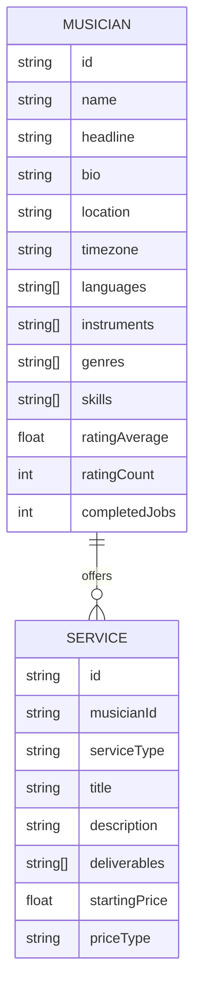

# Marketplace Data Schema

This document defines the core data structures for the Musician Services Marketplace. All backend models and API responses should align with these definitions.

## Relationship Overview

---

## 1. Musician Object

The primary entity representing a service provider on the platform.

| Field | Type | Description |
| :--- | :--- | :--- |
| `id` | UUID | Unique identifier. |
| `name` | String | Full professional name. |
| `headline` | String | Short, punchy professional tagline (e.g., "Grammy-winning Cellist"). |
| `bio` | Text | Detailed professional background and experience. |
| `location` | String | Primary city/base of operations. |
| `timezone` | String | IANA timezone (e.g., "Europe/Berlin"). |
| `languages` | Array<String> | List of spoken languages. |
| `instruments`| Array<String> | Primary instruments played. |
| `genres` | Array<String> | Musical styles/genres. |
| `skills` | Array<String> | Specific technical or creative skills (e.g., "Mixing", "Sight Reading"). |
| `ratingAverage` | Float | Calculated average rating (0.0 - 5.0). |
| `ratingCount` | Integer | Total number of reviews received. |
| `completedJobs` | Integer | Total number of successfully delivered services. |
| `responseTime` | String | Average response time (e.g., "under 2 hours"). |
| `gallery` | Array<URL> | Images of the musician or their studio. |
| `audioSamples` | Array<Object> | List of audio preview objects (Title, URL, Duration). |
| `videoSamples` | Array<Object> | List of video/performance URLs (YouTube/Vimeo/Direct). |
| `badges` | Array<String> | Verified achievement markers (e.g., "Top Pro", "Studio Verified"). |

---

## 2. Service Object

Defined offerings provided by a musician. One musician can offer multiple services.

| Field | Type | Description |
| :--- | :--- | :--- |
| `id` | UUID | Unique identifier for the service. |
| `musicianId` | UUID | Reference to the offering musician. |
| `serviceType` | Enum | Category: `SESSION`, `LIVE`, `LESSON`, `COMPOSITION`, etc. |
| `title` | String | Descriptive title of the service. |
| `description` | Text | Detailed explanation of what the buyer receives. |
| `deliverables` | Array<String>| Specific files or outcomes (e.g., "WAV Stems", "1-hour Zoom call"). |
| `startingPrice`| Float | Minimum price for the service. |
| `priceType` | Enum | `FIXED`, `HOURLY`, or `CUSTOM`. |
| `packages` | Array<Object>| Support for `BASIC`, `STANDARD`, `PREMIUM` tiers. |
| `turnaround` | String | Estimated delivery time (e.g., "3 days"). |
| `revisions` | Integer | Number of included revision rounds. |
| `tags` | Array<String>| Contextual keywords for search optimization. |
| `deliveryMode` | Enum | `REMOTE`, `IN_PERSON`, or `HYBRID`. |

---

## Future Expansion Entities
* **Reviews:** User testimonials, star ratings, and verified purchase flags.
* **Bookings:** Transaction records, status tracking (`PENDING`, `ACTIVE`, `COMPLETED`), and escrow details.
* **Availability:** Advanced calendar rules for live bookings or consultations.
* **Messaging:** Threaded communication history between buyers and musicians.
